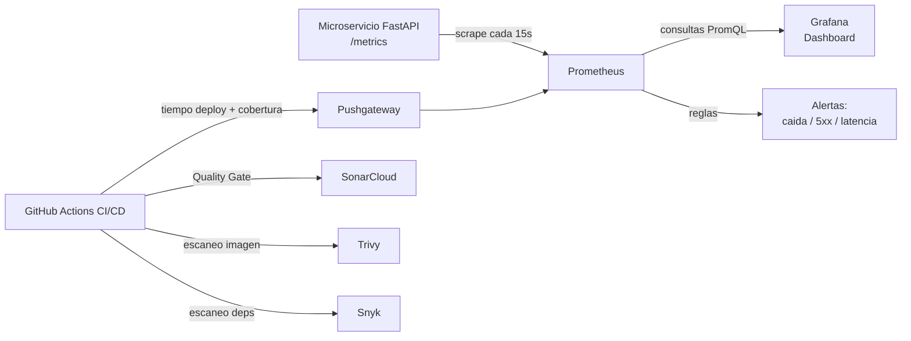
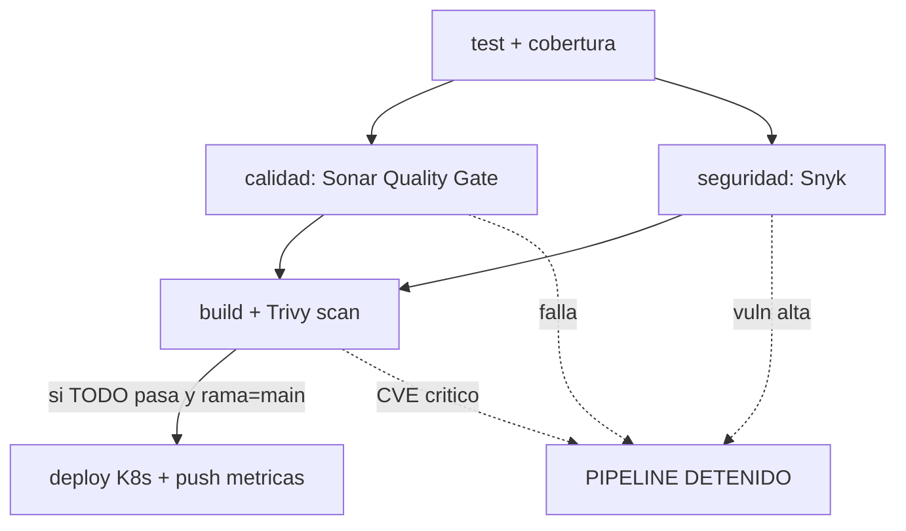

# Arquitectura de Observabilidad y Cumplimiento (apoyo IE4 / IE5)

## Diagrama del flujo de observabilidad

## Diagrama del pipeline (orden y bloqueo)

## Métricas clave del dashboard (IE3)

| Métrica | Fuente | Para qué sirve |
|---|---|---|
| Throughput (req/s) | `http_requests_total` | Carga del servicio |
| Latencia p95 | `http_request_duration_seconds_bucket` | Experiencia de usuario |
| Errores 5xx + negocio | `http_requests_total{status=~"5.."}`, `errores_negocio_total` | Salud del servicio |
| CPU | `process_cpu_seconds_total` | Capacidad / escalado |
| Memoria | `process_resident_memory_bytes` | Fugas / límites |
| Cobertura de pruebas | `test_coverage_percent` (desde CI) | Calidad |
| Tiempo de despliegue | `deploy_duration_seconds` (desde CI) | Eficiencia del pipeline |

## Branch protection rules en GitHub (IE5)

Configurar en **Settings → Branches → Add rule** sobre la rama `main`:

1. ✅ *Require a pull request before merging* (mínimo 1 revisor).
2. ✅ *Require status checks to pass before merging* → seleccionar los checks
   `test`, `calidad`, `seguridad-dependencias`, `build-y-scan`.
3. ✅ *Require branches to be up to date before merging*.
4. ✅ *Do not allow bypassing the above settings*.

Con esto, ningún cambio entra a `main` si el pipeline (incluido el Quality Gate
y los escaneos de seguridad) no pasó: cumplimiento normativo automatizado.
